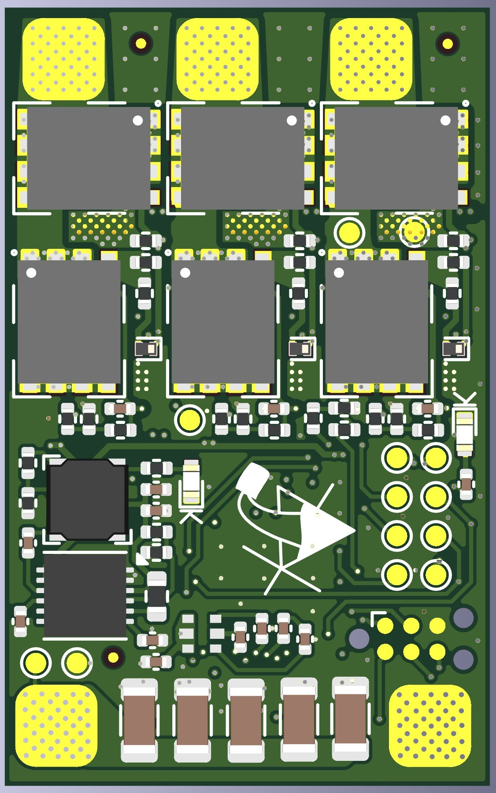
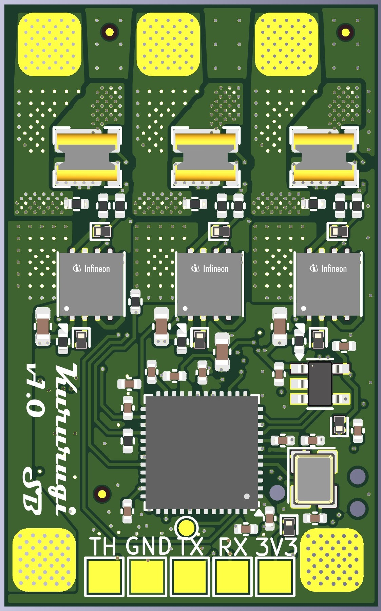

# ⚡ Kururugi - Electronic Speed Controller (ESC) ⚡ 

> 4/6S-ready • 64–96 kHz PWM • FOC/Six-Steps • Full bare-metal control

<p align="center">
  
  
</p>

## ⚙️ Project overview

Kururugi is a high-performance ESC designed for FPV drones, built as a platform for low-level motor control, power electronics optimization, and embedded system experimentation.

It is developed within the **Bare Metal Foundry** initiative for autonomous racing drones, alongside the Shirley Flight Controller—forming a complete, fully controlled hardware stack.

This README present the project and its git repository, more technical details are available here: 📊 [Technical Specifications](docs/kururugi-specs-hw.md)

## ❓ Why Kururugi?

Most ESCs are closed, optimized for mass production—not understanding.

Kururugi is built to:
- Push switching frequency limits (96 kHz+ and further)
- Enable full control of the motor stack (no black boxes)
- Training on Bare Metal, super fast control (128kHz is aimed at long term), on low level hardware
- Having fun with crazy makers and scientists, you are more than welcome to join the adventure !

👉 This is an engineering platform, not just an ESC.

## 🚢 Navigate the repo

> ⚠️ Documentation is still a work in progress. Detailed design notes and analysis will be added progressively.

### 📂 Not to miss documents:
- 🧩 **Hardware (KiCad)**: [Kururugi ESC Project](hardware/KiCad/Kururugi-ESC)
- 📊 **Design & Sizing**: [Sizing Spreadsheet](docs/)
- 📤 **Exports**: [Schematics, PCB renders, STEP files](docs/exports)
- 📚 **Resources**: [Datasheets & Engineering Notes](resources/datasheets)

## 💻 Run it yourself

### 📟 H/W - PCB desgin
To get started, clone the repository and proceed to open the project on Kicad 9.0.4. All libraries are self containts so it is no more difficult than this. Details documentation of the Kicad templates of the Bare Metal Foundry are available here [WORK IN PROGRESS].
```bash
git clone https://github.com/StepaneBinon/Kururugi-ESC-Dev-Board.git
```

### 📟 H/W - PCB manufacturing [WORK IN PROGRESS]

### 🔢 S/W - Kururugi-6Step [WORK IN PROGRESS]


### 🔢 S/W - Kururugi-FOC [WORK IN PROGRESS]


## 🚀 Roadmap [FLEXIBLE]

### ⚡ Hardware
1. 🧪 **V1.0 Production & Bring-up** *(Apr 2026)*: First batch with JLCPCB, full electrical validation
2. 📖 **Design Documentation** *(May 2026)*: Complete breakdown of sizing, losses, and trade-offs
3. 🔌 **Multi-ESC Test Bench** *(Jun–Jul 2026)*: Dedicated rig for synchronized testing and stress scenarios
4. 🏁 **Drone Validation (V1)** *(Jul–Aug 2026)*: High-load FPV testing on 6-inch platform
5. 🤖 **Robotics Validation (V1)** *(Jul–Aug 2026)*: Differential drive platform for control robustness
6. 📝 **Technical Paper (V1 Results)** *(Sep 2026)*: Performance, efficiency, and design insights
7. ⚡ **V2 Hardware** *(2027)*: Sensor simplification, FOC/6-step optimization, possible 4-in-1

### 🧠 Software
1. 🏗 **Bare-Metal C++ Architecture** *(Apr–May 2026)*: Deterministic design, coding standards, HAL strategy (rewrite vs minimal use)
2. ⚙️ **6-Step Control (Baseline)** *(May–Jun 2026)*: Reliable startup and fallback mode
3. 🎯 **FOC Implementation** *(Jun–Aug 2026)*: High-efficiency, high-performance control
4. 📝 **Technical Paper (Control & Results)** *(Sep 2026)*: Control strategy, tuning, and comparison

### 🌐 Ecosystem
1. 🧭 **Bare Metal Foundry Definition** *(Apr–Jun 2026)*: Define vision, scope, and project structure
2. 🧰 **Engineering Templates** *(May–Jul 2026)*: Standardize reports, CAD, PCB, and code frameworks

### 🔥 Vision
From raw hardware to advanced control algorithms, Kururugi aims to become a **fully transparent, high-performance ESC platform** for engineers who want control—not black boxes. It is also designed as a deeply documented learning platform, enabling curious students and developers to understand how hardware and software interact at the lowest level.

## 🤝 How to Contribute

> Alone we go faster, together we go further.

Contributions are more than welcome, at all levels:

- 🐛 **Report issues**: bugs, design flaws, or unclear documentation
- 💡 **Suggest improvements**: hardware, firmware, or architecture ideas
- 🧪 **Test & validate**: share results, measurements, or flight data
- 📖 **Improve documentation**: clarify concepts, add explanations

### 📬 Get involved

- Open an issue for discussion  
- Submit a pull request  
- Share your insights or experiments 
- Join the **Bare Metal Foundry** discord here: https://discord.gg/e7CF2AZCN 

👉 If you're working on ESCs, power electronics, or embedded control, your feedback is highly valuable.


