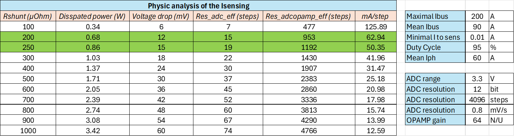

# Current sensing

First of all, we cannot sample with the adcs of the smt32g484 directly as the voltage drop for a reasonable amount of dissipated power is too low. We also cannot go a lot much lower 100µOhm resistor as really robust analogic will be needed (none are available on digikey).

