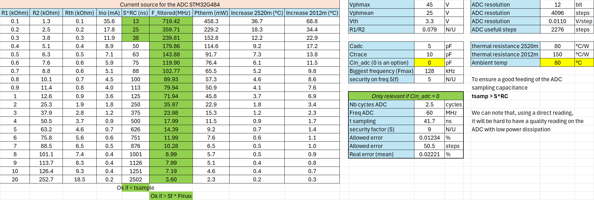
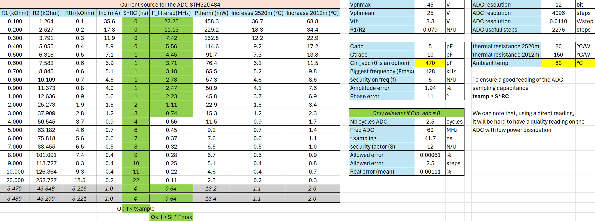
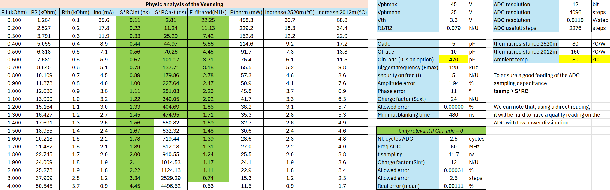

# Voltage Sensing

We must protect the ADC (3.3V) pin from surge that can be of 45V. So the tension divider:

Vadc = r1/(r1+r2) Vph => r1(Vadc - Vph) + r2Vadc = 0 => r1/r2 = Vadc/(Vph - Vadc) = 0.079

For the sensing of voltage, we face multiples issues:

1. 
As the ESC surface is really small, it is important to have a divider bridge with the largest resistance possible as less heat will be produced. The resistance of a divider bridge, when the current is not flowing, is Rtot = R1+R2.

2. 
In the same time, if Rtot is to strong, then the current passing trought R1&R2 is low. This is an issue as the charging speed of the ADC capacitor is dependent of the current flowing in. This can be computed using the thevenin equivalent with respect to the adc pin:

Vth = r1/(r1+r2)

Rth = r1r2/(r1+r2)

And as Ino = Vth/Rth, we can expect Rth to have an important impact on the current that can flow in the ADC capacitance.

This is demonstrated bellow, where we can observe that with no ADC pin external capacitance, we cannot hope for great precision and great termal control. To change this, we could use a buffer but this would add some footprint and otherall complexity. A easier option is to add a adc pin external capacitance, as we have margin on the filtering frequency, this won't have a drastic impact on performances, this is presented on the second image with 470pF. The drastic gain on S*RC is due to the resistance being set to 100 ohm on the ext capa to adc capa. 

We also have to consider that the added capacitor itself is slow to fill up. He will fill during the noisy blanking phase so it has to be fast to settle (<480ns). This is presented in the next figure. As it has to settle pretty fast, we decided to double the security factor (or charge factor) from 12Tau to 24Tau

We can expect the whole ESC to be able to dissipate 1.5W still and 3W in forced air