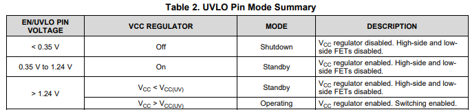

# Other choices

Following are listed some other engineering choices for the buck converter layout.

## Technical Brief: Output capacitor $C_{out}$

We have $\Delta I_{L,\max} = 397mA$ and we want 10mV of variation maximal. Hence, $C_{OUT} = \frac{\Delta I_{L,\max}}{8 \times f_{SW} \times \Delta V_{O,\text{ripple}}} = 5.5\mu F$. We will take $C_{OUT} = 1\times10 = 20\mu F$. We chosed to use 2 capacitance to reduce ESR in X7R with 2012m format with a voltage range of 25V to limit the impact of DC biais (6 to 8µF expected).

## Technical Brief: Forced PWM (FPWM)

If FPWM is put to low, then the efficiency is increased. The low side mostfet behave as a diode and some commutation steps can be skip if low cuurent is required. However, this create some noise and less predictable behavior overall as steps can be skipped. Thus we will force CCM by putting FPWM to high.

## Technical Brief: Selection of the Feedback Resitors

$V_{OUT} = \frac{V_{REF} \times (R_{FB1} + R_{FB2})}{R_{FB1}}$, specified in the datasheet.

Where $V_{REF} = 2V$. We want $V_{OUT} = 10V$ so $\frac{R_{FB2}}{R_{FB1}} = 4$. We should try to keep the sum (lost power), in the $10k\Omega \text{ to } 100k\Omega$ order. We will use 10kR and 39.2kR, so $V_{REF} = 2.041V$

## Technical Brief: Selection of the Current Limit Timer $C_{VCC}$

It is recommended to have $C_{VCC} = 1\mu F$, good quality X7R.

## Technical Brief: Selection of the Soft Start Capactor $C_{SS}$

Soft start is important to limit current flow at ESC start as all capactior will require to be chatge simultaneously. If well control, it could even be used to reduce the resistance of the external boostrap diode resistance of the gate drivers so we can charge it faster during normal operation.

$C_{ss}$ must be greater than 1nF. For VersionV1.0, having a long soft start seems very relevant to avoid bug. In general, having a long start for ESC does not have an major impact.

$C_{SS} = \frac{I_{SS} \times T_{\text{startup}}}{V_{SS}}$

With $V_{SS} = 2V$, $I_{SS} = 10\mu A$ and $C_{SS}=1\mu F$, we have $T_{\text{startup}} = 200ms$.

## Technical Brief: Selection of the Current Limit Timer $C_{BST}$

It is recommended to have $C_{BST} = 10nF$, with a good quality X7R. It is fed by $C_{VCC}$ during off times.

## Technical Brief: Under voltage lockout - RUV1/RUV2

We decided to aim for 12.0V minimum Vbat so $V_{IN,\text{rise}}=12V$. We also need an important hysteresis as the battery will have a lot of sag, hence $\Delta V_{IN}=4V$ and, it is given $I_{HYS}=20µA$. This enforces:

$R_{UV2} = \frac{\Delta V_{IN}}{I_{HYS}} = 200\,\text{k}\Omega$. 

We want $V_{IN,\text{rise}} = 14V$ and have $V_{UVLO,\text{TH}} = 1.24V$. Hence:

$R_{UV1} = \frac{R_{UV2}}{\left(\dfrac{V_{IN,\text{rise}}}{V_{UVLO,\text{TH}}} - 1\right)} = 23k\Omega$

We will take $R_{UV1}=22\text{k}\Omega$ and $R_{UV2}=200\text{k}\Omega$

## Technical Brief: Input cqpqcitor CIN

Maximum allowed ripple is around 0.25V. D=10/24=0.4.

$C_{IN} = \frac{I_{O,\max} \cdot D \cdot (1 - D)}{\Delta V_{IN,\text{ripple}} \cdot F_{SW}} = 1\mu F$

## Technical Brief: Selection of the Collector Voltage $V_{CC}$

As the $V_{out}$ voltage is 10V, $V_{cc}$ could be powered using $V_{out}$ to gain efficiency and limit termal losses inside the chip (with the LM5160A chip). It is not implemented as it adds layout complexity for a gain we deemed minimal.