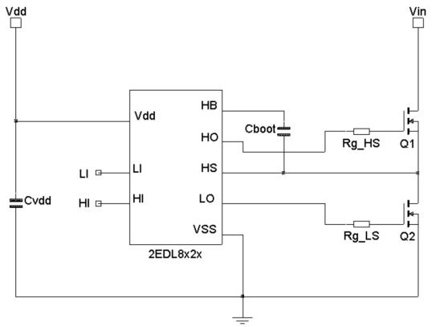
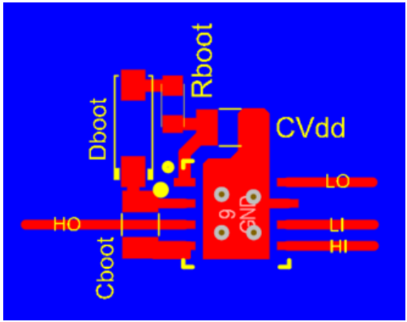
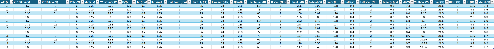

# Gate Driver

We will use the INFINEON 2EDL8024 as it is the one that allows the most source and sink current and the pin can be driven independently, which is great as the MCU will be resonsible for dead time. For the package, we chosed to use the VDSON-8 which is 4x4mm, slighlty lqrger, it allows better cooling and we already have a recommended footprint for it.

## Technical Brief: Selection of the Bootstrap Capacitor $C_{boot}$ and diode $D_{boot}$

An usual value in the drone context is to take Cg=1µf. Lets check it is ok with my configuration. We can use the datasheet of the INFINEON 2EDL8X2X.

a) $\Delta V_{Cboot\_max} = V_{dd} - V_F - V_{HBR} - V_{HBH} = 2.03V$

as maximum are $V_{dd} = 10V$, $V_F = 1.25V to 2.15V = 1.7V$, $V_{HBR} = 6.0V$ and $V_{HBH} = 0.27V$

b) $Q_T = Q_g + \frac{I_{HB}+(I_{HBS}+I_{pulldown})*0.95}{F_{SW}} = 238.2nC$

as maximum are $Q_g = 120nC$, $I_{HB} = 0.7mA$, $I_{HBS} = 1.25mA, I_{pulldown}=1mA$ and $F_{SW\_min} = 24kHz$, for 100% duty cycle

Both $I_{HB}$ and $I_{HBS}$ are quite high, this is a price to pays for fast propagation time and gate opening/closing.

c) $C_{boot\_min} \geq \frac{Q_T}{V_{Cboot\_max}} = 117.3nF$

Hence, we will rely on a 300nF capactiance for 50V, to ensure minimal DC biais. We expect 20% max of DC biais so 240nF which is a x2 security factor. Hence, the max tension lost during a cycle will be of dV=Qt/C=992mV and not 2.03V.

At the start of a charging cycle (high side low), due to Vf, the voltage is of Vdd-Vf-deltaV = 10-1.7-0.992=7.308V. To charge the capacitor back to its original voltage of Vdd-Vf = 8.3V. The internal diode caracteristics are mostly unknown, we only know that Vf=1.25V@100µA (end of filling) and Vf=2.15V@100mA (start of filling). We chosed the second one as reference: Rf=21.5Ohm in mean. Given the formula: R=21.5Ohm, C=240nF, Vfwanted=8V, V0=7.3V, Vdd=8.3V. Hence, 6.2µs are needed to fill the capacitor, which is not acceptable as:

- At 128kHz and 95% duty cycle $0.4\mu s$ are available to charge Cboost (ultimate goal). 
- At 96kHz and 95% duty cycle, $0.531\mu s$ are available to charge Cboost. 
- At 64kHz and 95% duty cycle, $0.781\mu s$ are available to charge Cboost.
- At 48kHz and 95% duty cycle, $1.042\mu s$ are available to charge Cboost.
- At 24kHz and 95% duty cycle, $2.083\mu s$ are available to charge Cboost.

Thus, 2 methods can be employed:
1. Add an additionnal diode
2. Raise Vdd

Let first add an additional diode and a 5R resistor. We selected the RB161QS-40 which as a forward voltage of 0.38V (+0.5V from resistor) at 100mA and a reverse current of 40µA. Bringing $\Delta V_{Cboot\_max} = 2.85V$, $Q_T \approx 238.2nC$ and $C_{boot\_min} \geq = 83.6nF$.

To keep the x2 security factor, we select a 200nF (DC biais 150nF) capacitance for Cboot, so $\Delta V_{Cboot\_max} = 1.59V$ during a cycle. We chosed the second one as reference: Rf=21.5Ohm in mean. Given the formula: R=4.06Ohm, C=150nF, Vfwanted=8.1V, V0=8.03V, Vdd=9.62V. Hence, 0.2µs are needed to fill the capacitor. This time, it is possible to work at an high duty without major compromise on Vboot!

Computation are sum up here, we can see that using 11V from start add a lot of benefits! The downside to work at lower voltage is that Rdson increase on long duration.

## Technical Brief: Selection of the Gate Resistor $R_{G}$

We can change these capacitance after installation so we will first select one that allows low EMI to ensure reliability. 

It is important to keep the gate turn-off resistance $R_{G,\text{off}}$ sufficiently low to ensure immunity against displacement currents generated by high $\mathrm{d}v/\mathrm{d}t$ during switching off events. Rapid voltage transitions at the drain induce a displacement current through the gate–drain (Miller) capacitance $C_{GD}$ that may re-trigger the mosfet.

If $R_{G,\text{off}}$ is too large, this current cannot be evacuated quickly and instead charges the gate capacitance $C_{GS}$, causing the gate voltage to rise. In extreme cases, $V_{GS}$ may exceed the threshold voltage, resulting in unintended self turn-on of the MOSFET, increased switching losses, or shoot-through in a half-bridge configuration.  

Using a low $R_{G,\text{off}}$ provides a low-impedance path to rapidly sink the Miller-induced current and clamp the gate voltage close to the source potential during turn-off. In addition, a dedicated gate-to-source pull-down resistor (typically around 10 kΩ) ensures a defined OFF state when the driver is high-impedance (startup, reset, or fault conditions) and prevents long-term charge accumulation on the gate due to leakage or capacitive coupling.

We will take $R_{G,on} = 10\Omega$ and $R_{G,off} = 5\Omega => 10\Omega$ as resistances are parallel. We will use the same diode as for the bootstrap capacitor. 

This will cap the source current at 1A and the sink current at 2A, which will allow us to make the first steps before scaling up to bigger values (4A source and 5/6A sink max).

We estimate the gate-drive dissipation starting from the MOSFET gate charge.

Given a total gate charge \(Q_g = 120\,\text{nC}\) at a gate voltage of \(V_{GS} = 10\,\text{V}\), the gate can be approximated by an equivalent capacitance:
$C \approx \frac{Q_g}{V_{GS}} = \frac{120\,\text{nC}}{10\,\text{V}} = 12\,\text{nF}$

The energy dissipated in the resistive gate-drive path during a single charging event (turn-on) is:
$E_{\text{on}} = \tfrac{1}{2} C V_{GS}^2
= \tfrac{1}{2} \cdot 12\,\text{nF} \cdot 10^2
= 600\,\text{nJ}$

During turn-off, the energy stored in the gate capacitance is discharged through the gate-drive path and dissipated as heat:
$E_{\text{off}} = \tfrac{1}{2} C V_{GS}^2 = 600\,\text{nJ}$

Therefore, the total energy dissipated per complete switching cycle (turn-on + turn-off) for one MOSFET is:
$E_{\text{cycle}} = E_{\text{on}} + E_{\text{off}} = 1.2\,\mu\text{J}$

At a switching frequency of \(f_{sw} = 128\,\text{kHz}\), the average gate-drive power per MOSFET is:
$P_{\text{gate}} = E_{\text{cycle}} \cdot f_{sw}
= 1.2\,\mu\text{J} \cdot 128\,\text{kHz}
\approx 154\,\text{mW}$

Since two MOSFETs are driven simultaneously in the half-bridge (neglecting additional commutations due to phase changes), the total gate-drive dissipation is approximately:
$P_{\text{HB}} \approx 2 \cdot 154\,\text{mW} \approx 310\,\text{mW}$

This level of dissipation is acceptable given an idle board thermal budget of approximately 1–2 W. Other sources of heat (MOSFET conduction losses, switching losses in the power stage, driver losses, etc.) must of course be considered separately.

In practice, operation at 128 kHz is not targeted for the first hardware revision, both because the gate charge cannot be transferred fast enough with the chosen gate resistance and to preserve additional thermal margin. A maximum switching frequency of 64 kHz is therefore planned for V1, providing significant headroom on gate-drive dissipation.

## Technical Brief: Selection of the Bypass Capacitor $C_{V_{dd}}$

Common rules is to have $C_{Vdd} \geq 10 \sim 20 * C_{boot}$. Hence, for safety, we will take 15µF in a 3216m/3225m package.
