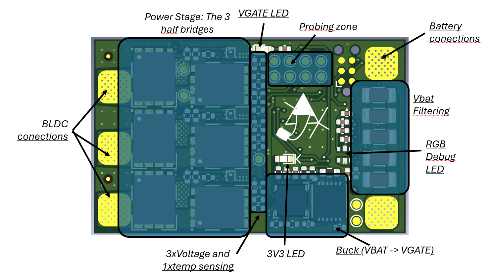
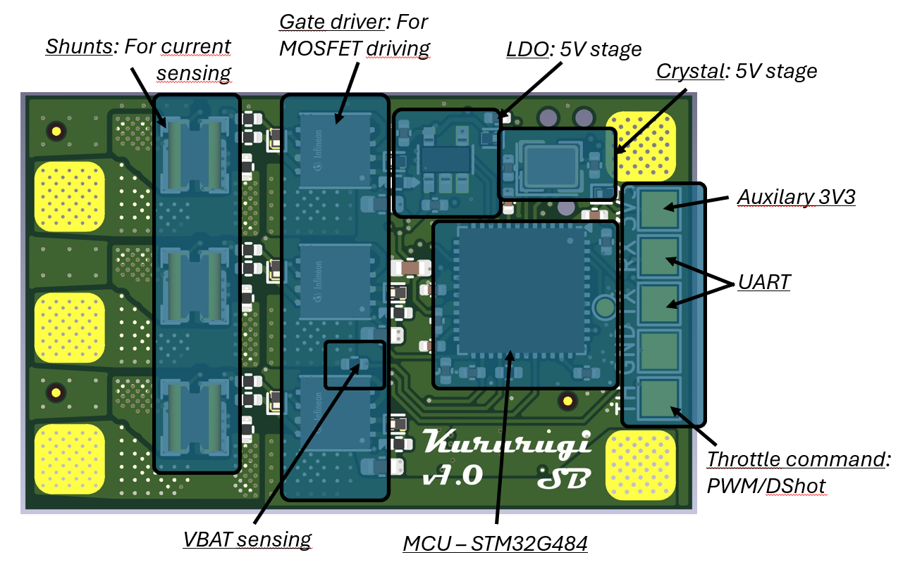
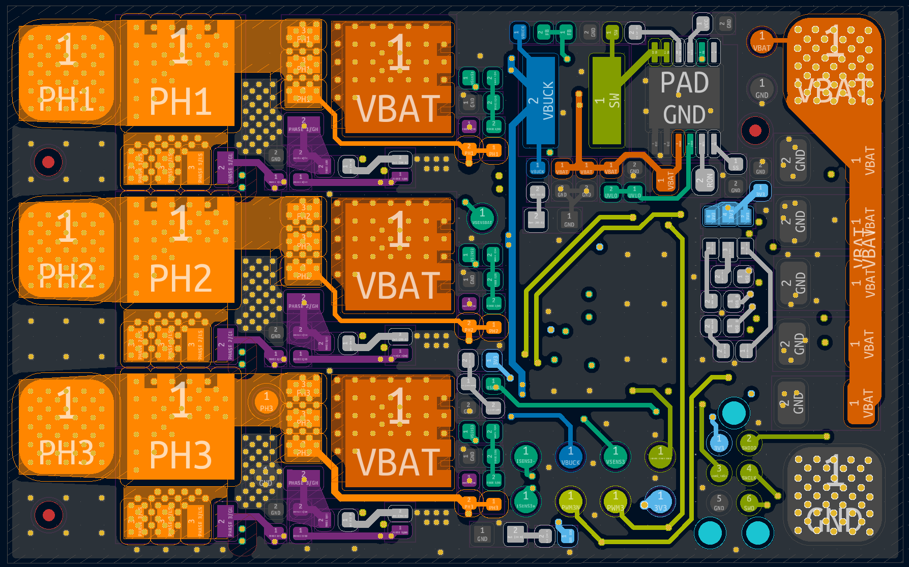
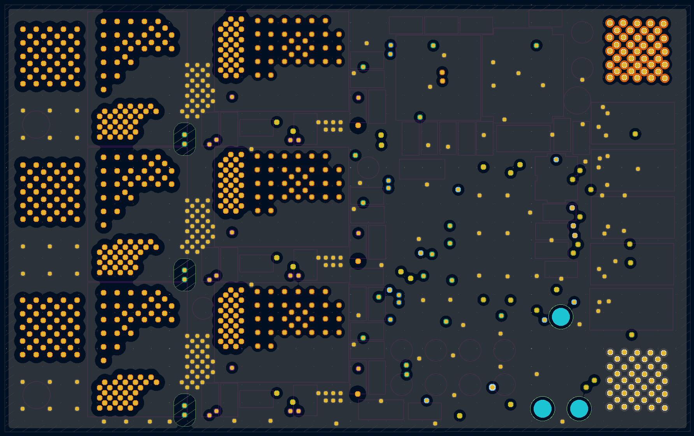
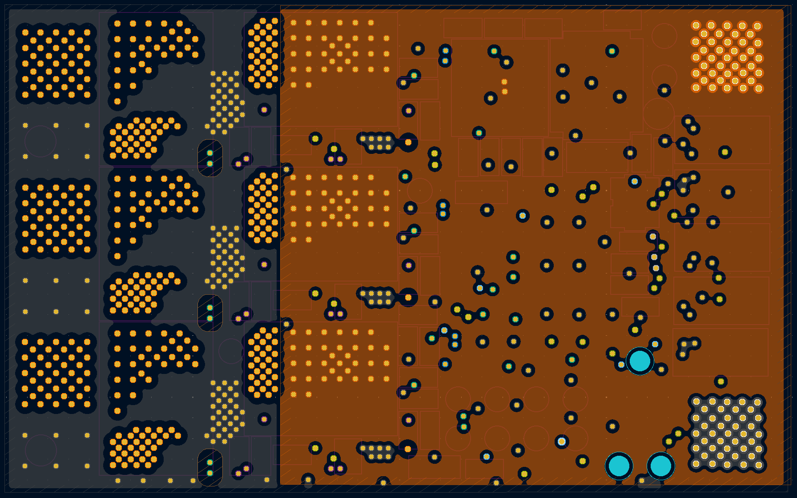
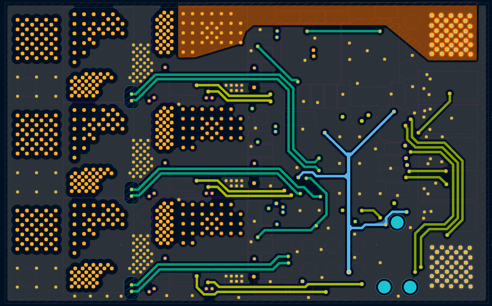
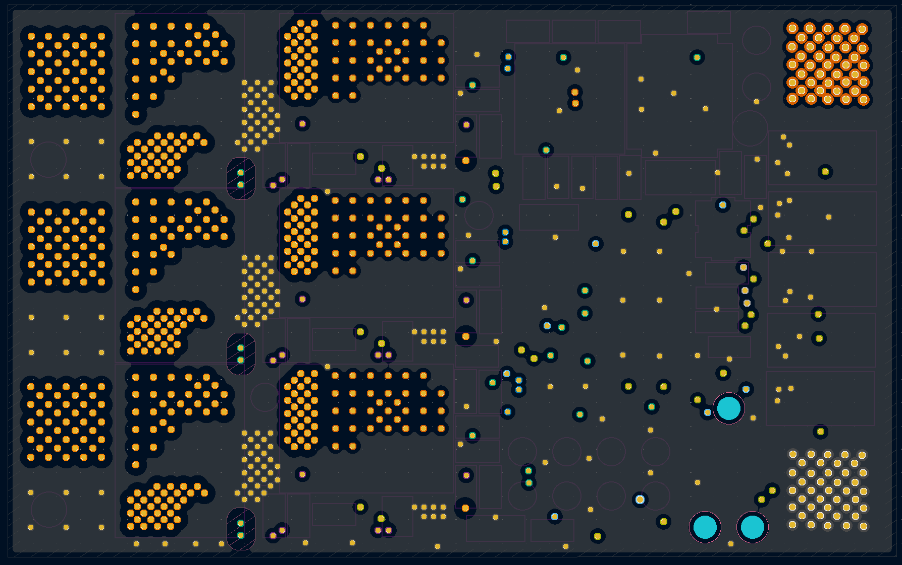
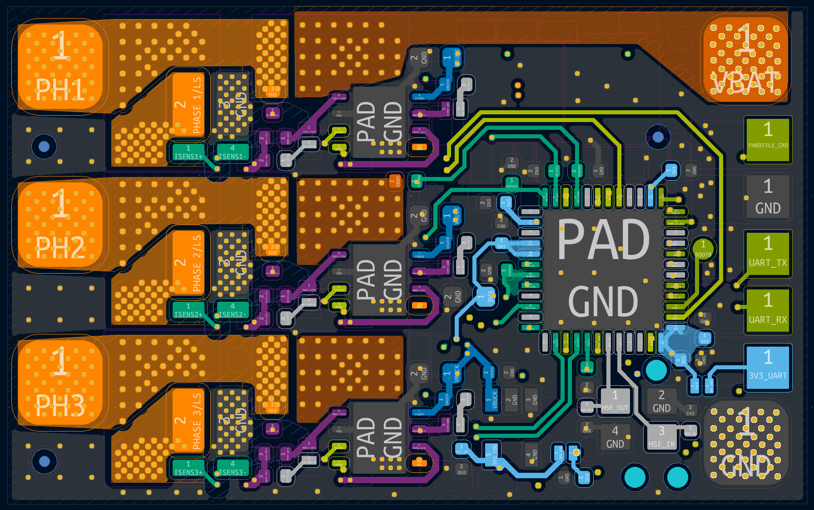

# ⚡ Kururugi ESC - Technical Specifications

> Detailed hardware architecture and performance targets

## 🧭 Overview

Kururugi is a compact, high-performance ESC designed for drones and differential-drive robotics. The design focuses on high switching frequency operation, low parasitics, and precise sensing. This version is sensorless, which limits low-speed performance. Detailed sizing is available in:
```
docs/Kururugi-ESC-sizing.xlsx
```

The design is inspired by the B-G431B-ESC1.

## 📟 Board Presentation




## 🧱 PCB Stackup (6 Layers)

The stackup is optimized for current density, thermal performance, and EMI control.

<table>
<tr>
<td>

**Layer 1 - Power (MOSFET, BUCK)**  


</td>
<td>

**Layer 2 - GND plane**  


</td>
</tr>

<tr>
<td>

**Layer 3 - VBAT plane**  


</td>
<td>

**Layer 4 - Signal routing**  


</td>
</tr>

<tr>
<td>

**Layer 5 - Clean GND reference**  


</td>
<td>

**Layer 6 - Control (MCU, shunts, LDO)**  


</td>
</tr>
</table>
Outer layers use 2 oz copper, and vias are filled and capped for reliable via-in-pad and thermal conduction.

## ⚙️ Subsystemps

### 1. 🧠 MCU & Sensing [[details](./hw-mcu-and-sensing.md)]

The system is built around the STM32G484 with advanced timers, ADCs, and internal op-amps.

Phase current is measured using 0.5 mΩ shunts with Kelvin routing and internal amplification. VBAT and optional phase voltages are measured through resistor dividers.

ADC sampling is optimized for speed (~2.5 cycles), with careful impedance control. A third current channel is optional due to ADC limitations.

### 2. 🔋 Power System [[details](.\hw-power-system.md)]

Three power rails are present on the board. First is VBAT, provided directly by the battery input. Then, this rails is lowered to 11.5V for the MOSFET gate driving. Finally a third rail lower the VBUCK rail to 3V3 to power the MCU and LEDs.

An extenal 3V3 pad is exposed to work with the MCU using an external power supply to work directly from an UART converter easily.

More information on the power stage can be found here: 

### 3. ⚡ Power Stage [WORK IN PROGRESS]

The design uses a three-phase half-bridge directly supplied from VBAT. Layout minimizes switching loop area and parasitic inductance while ensuring good thermal spreading.

### 4. 🚪 Gate Driving [WORK IN PROGRESS]

A high-current gate driver (~3 A / ~5 A) enables fast switching. Asymmetric gate resistors allow tuning of switching behavior and EMI.

Bootstrap capacitor sizing is critical and defined in the sizing spreadsheet.

### 5. 🌡️ Monitoring [WORK IN PROGRESS]

An NTC thermistor provides board temperature monitoring.

### 6. 📡 Communication [WORK IN PROGRESS]

A UART interface enables telemetry and future real-time monitoring tools. USB was not retained due to layout constraints.


