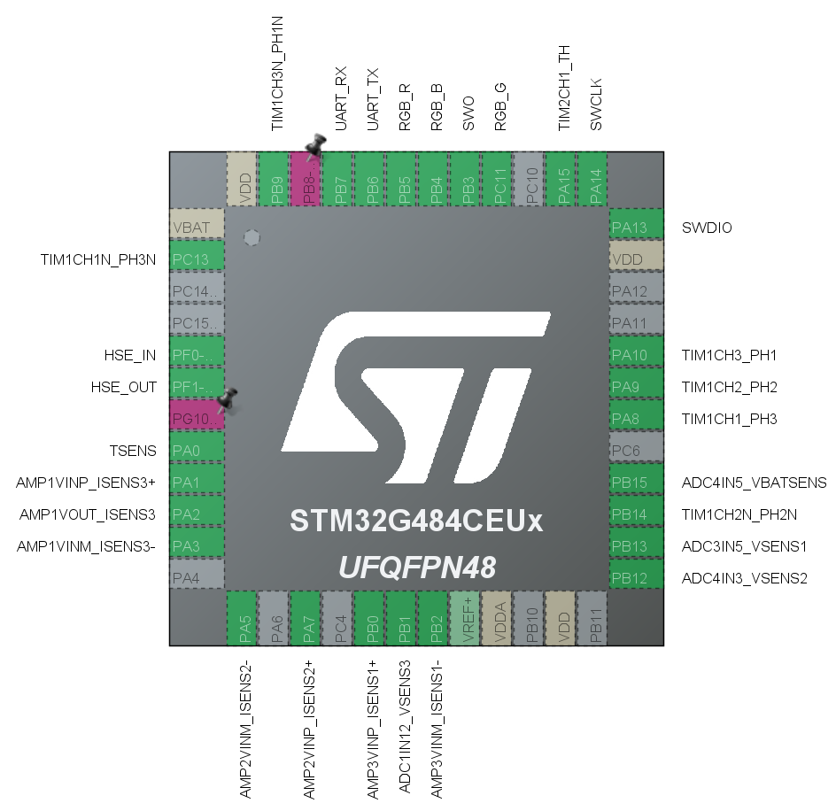

# MCU & Sensing

## 🧠 MCU

The system is based on an STM32G484, selected for its strong analog integration and motor-control-oriented peripherals. It provides fast ADCs with injected conversions, advanced timers suited for high-frequency PWM, and integrated OPAMPs, which significantly reduce external components while improving signal quality and latency.

Three sensing probes are implemented for both phase voltage and current. While this is not strictly required for FOC or six-step control, it was intentionally included in this first revision to allow full observability and validation of the system behavior. This provides better insight during bring-up, tuning, and debugging.

For current sensing, the signals are routed through internal OPAMPs. This ensures proper scaling of the shunt voltage and, more importantly, presents a low impedance to the ADC inputs, enabling fast and reliable sampling.

## 📡 Sensing

All signals are acquired through the ADC. When using an internal OPAMP, the ADC sees a low impedance source, enabling fast sampling. In contrast, direct measurements (e.g. resistive dividers) present a high impedance, so the effective input resistance $R_{AIN}$ must comply with STM32 ADC requirements (see `docs/exports/imgs/mcu/rain.png`). Detailed sizing is available in `docs/Kururugi-ESC-sizing.xlsx`.

### 🔋 Vsensbat

The battery voltage is measured using a resistive divider. A high resistance (22 kΩ) is used to reduce BOM and losses, but this results in a slow acquisition time (~408 µs at 12-bit). A 100 nF capacitor at the ADC input mitigates this by charging during blanking time.

### ⚡ VsensPh1 / Ph2 / Ph3

Phase voltages are measured using the same divider approach, with identical constraints and mitigation using a 100 nF capacitor. All three phases are currently measured, but future versions may reduce this to two.

### 🔌 Isens Ph1 / Ph2 / Ph3

Phase currents are measured using a 0.5 mΩ Kelvin shunt. The signal is routed as a differential pair to an internal OPAMP, which both amplifies it and provides a low impedance output to the ADC. All three phases are measured, but future versions may reduce this or move to VBAT sensing.

### 🌡️ Tsens

Temperature is measured using an NTC thermistor connected to the ADC through a resistive divider.