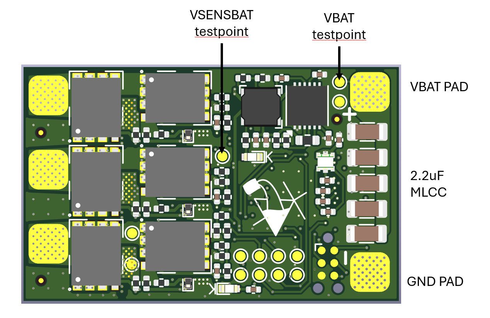

# ⚡ Power System

## 🔋 VBAT

VBAT is supplied by a 4S to 6S battery. Input filtering is ensured by five 2.2 µF (3216) capacitors to mitigate cable-induced ringing [1], which can reach up to 45 V during transients.  

For V1.0, input protection remains minimal; additional Schottky diodes and improved ESD protection will be introduced in future revisions.

VBAT is monitored through a resistive divider connected to ADC5 Channel 1 (pin X). Dedicated test points are available for both VBAT and VSENSBAT measurements. The scaling is defined such that 25 V corresponds to approximately 1.1 V at the ADC input.

The acceptable operating limits for V1.0 are summarized below:

- Typical phase current (@ 95% ToF): 12.5 A  
- Maximum phase current (short duration): 20 A  
- Peak current spike (transient): 50 A  

## 🚪 VBUCK *(Work in progress)*

## 🔌 3V3 *(Work in progress)*

